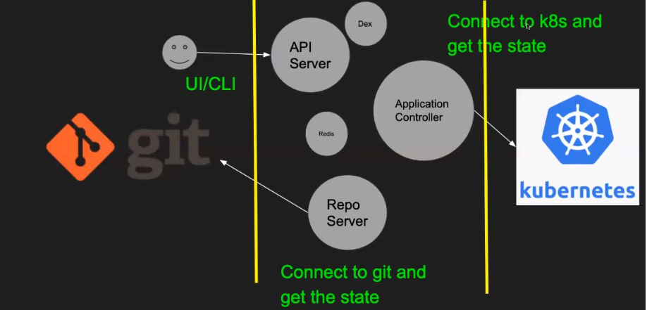

Understanding GitOps with Argo CD Architecture 🚀

Hello, DevOps enthusiasts! Welcome back to our GitOps series. Today, we dive into the fascinating world of Argo CD, a popular GitOps tool. This episode is particularly exciting as we'll explore the architecture of GitOps tools like Argo CD and Flux CD, providing you with the knowledge to understand and switch between these tools seamlessly.

Why GitOps? 🤔

Before we delve into today's content, it's crucial to understand the foundation laid in Part 1 of our series. If you haven't watched it, please do! It covers the basics of GitOps, its principles, and why tools like Argo CD and Flux CD are essential in the DevOps space.

Popular GitOps Tools 🛠️
Let's start by listing some of the most popular GitOps tools in the market:

Argo CD - Widely regarded as one of the best GitOps tools.
Flux CD - Another strong contender, often compared with Argo CD.
Jenkins X - Integrates well with Jenkins for a GitOps approach.
Spinnaker - Primarily a deployment tool but can be used for GitOps.
While Spinnaker focuses more on deployment, tools like Argo CD and Flux CD are designed explicitly for GitOps, making them more robust for maintaining state between Git and Kubernetes.

Argo CD: A Brief History 📜

Argo CD was initially developed by engineers at Applatix, which later got open-sourced and acquired by Intuit. It's now a CNCF graduated project with contributions from companies like BlackRock, Codefresh, Intuit, and Red Hat. With over 13k stars on GitHub, Argo CD's popularity speaks for itself.

The Architecture of Argo CD 🏛️

Understanding the architecture of Argo CD helps you grasp how any GitOps tool functions. Here's a breakdown:

Core Components

Repo Server: Connects to Git and retrieves the desired state of the system.

Application Controller: Interacts with Kubernetes to get the current state and ensures it matches the desired state from Git.

API Server: Facilitates user interaction through UI and CLI, handling authentication and authorization.

Dex: Provides single sign-on (SSO) capabilities.

Redis: Used for caching to maintain state and ensure seamless operations, even if components restart.

How It Works

Syncing State: The repo server fetches manifests from Git, while the application controller retrieves the current state from Kubernetes. These are compared to ensure they are in sync.

User Interaction: Users interact with Argo CD through the API server, which supports SSO and integrates with existing authentication systems via Dex.

Reconciliation Logic: If a manual change is made in Kubernetes, the application controller ensures that the cluster state is reverted to match the Git manifests, providing an auto-healing capability.

Installation and Next Steps 🔧
Argo CD can be installed using YAML manifests, Helm, or Kubernetes operators. In our next blog, we'll demonstrate the installation process and deploy an application onto a Kubernetes cluster using Argo CD. We'll also delve into more advanced GitOps scenarios and interview questions.

Stay tuned for the next blog, where we'll bring these concepts to life with a live demo! 🌟

Key Takeaways

GitOps Tools: Argo CD, Flux CD, Jenkins X, Spinnaker
Core Architecture: Repo Server, Application Controller, API Server, Dex, Redis
Key Concepts: Syncing state, reconciliation logic, SSO capabilities